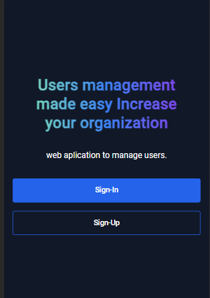

# Web Application for User Administration in Angular

## Description

This project is a web application developed for comprehensive user management, employing technologies such as Angular on the frontend and fastApi and layered architecture on the backend for a complete and secure experience.

## Functional Requirements:

- **User Registration:** Allow users to create new accounts by providing basic information like name, email, and password.

- **Login:** Provide a secure mechanism for users to log in using valid credentials.

- **Profile Management:** Enable user to update users information, such as changing passwords, updating name, and email

- **User Listing:** Display a list of registered users with the ability to search, filter, and sort.

- **Security & Authentication:** Ensure account security through proper password management, two-factor authentication (if necessary), and measures against attacks like SQL injection or XSS.

## Non-Functional Requirements:
- **Security:** Ensure the application complies with security standards and data protection by using encryption protocols and good security practices.

- **Performance:** Maintain optimal performance of the application by ensuring minimal load times and quick system response even under heavy loads.

- **Usability:** Design an intuitive and user-friendly interface to enhance the user experience, with simple navigation and clear understanding of functionalities.

- **Scalability:** Design the application to easily scale to handle increased user and data volumes as the application grows.

- **Maintainability:** Ensure the code is modular, easy to maintain and extend, with clear comments and a well-organized structure.

- **Compatibility:** Ensure the application is compatible with multiple browsers and devices to reach as many users as possible.

### Architecture used:  Component Composition Architecture in Angular

The Component Composition architecture in Angular is based on building the user interface by composing modular and reusable components. These components encapsulate logic and presentation, allowing for a modular and maintainable structure.

#### What I practiced

- **Communication between components:** Angular provides various methods for communication between components, such as `@Input`, `@Output`, services, and the use of observables with RxJS.

- **Routing:** Routing in Angular allows efficient and structured navigation between different views, facilitating the creation of single-page applications (SPAs).

- **Handling services and interceptors:** Services in Angular allow centralizing business logic and data exchange with the backend. Interceptors, on the other hand, are used to globally modify HTTP requests.

- **Usage of interfaces:** Interfaces in TypeScript are used to define object shapes, promoting static typing and preventing runtime errors.

- **SOLID principles:** Angular allows the application of SOLID principles like Single Responsibility, Open/Closed, and Liskov Substitution through its structure and design patterns.

- **Session handling with JWT:** Session management using JSON Web Tokens (JWT) is securely implemented in Angular, enabling authentication and authorization in the application.

- **Route protection and other features:** Angular provides mechanisms to protect routes, ensuring that certain parts of the application are only available to authorized users, along with other advanced features like lazy loading, pipes, directives, among others.

## MOBILE
## Home

## Footer

## Login

## Login validation

## Register

## Register validation

## Dashboard

## DESKTOP
## Home

## Update_Create_Form

## Footer

## Dashboard

Thank you for reviewing the project!
